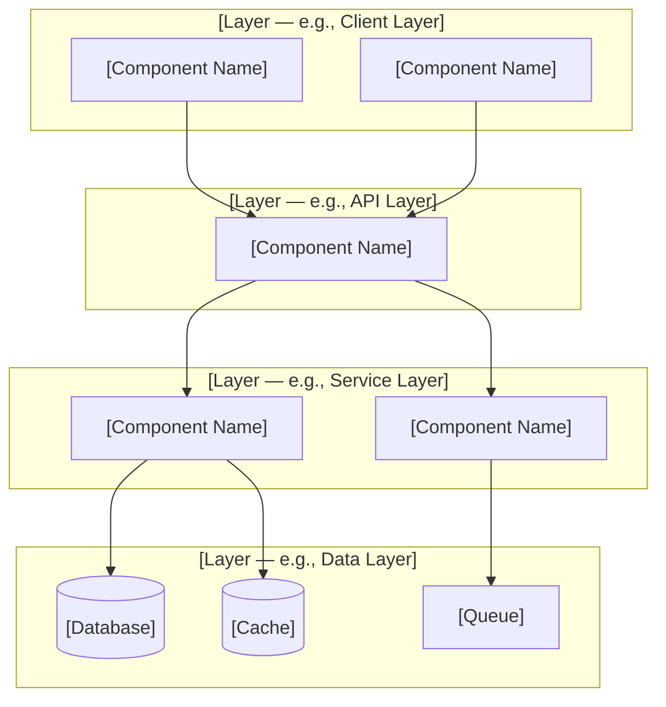
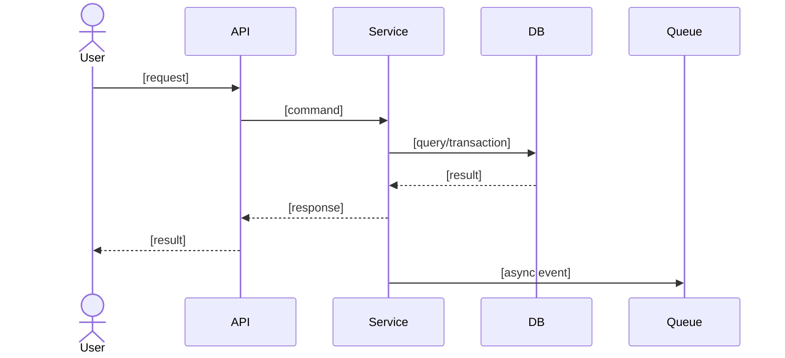
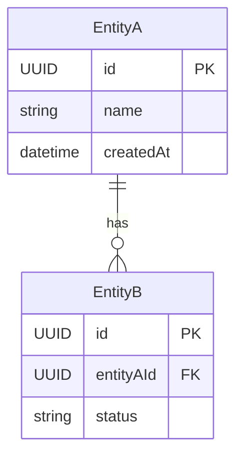

# ARCHITECTURE.md

> **Status**: [Draft | Review | Approved] &nbsp;|&nbsp; **Last updated**: [YYYY-MM-DD] &nbsp;|&nbsp; **Author**: [Name / Team]

### Section Map — read this before filling

| Section                       | Required?               | Purpose                                                                                                                                                       |
| ----------------------------- | ----------------------- | ------------------------------------------------------------------------------------------------------------------------------------------------------------- |
| System Overview               | ALWAYS                  | One-paragraph elevator pitch                                                                                                                                  |
| Architecture Pattern          | ALWAYS                  | Chosen pattern + alternatives evaluated, or explicit `None required` when no pattern genuinely applies                                                        |
| Architecture Views & Diagrams | ALWAYS (system diagram) | System diagram (or explicit `None required` when none applies); runtime sequence when it adds clarity; ERD only with a data model in scope                    |
| Component Details             | ALWAYS                  | Per-component: tech, responsibility, scaling, deps, failure modes                                                                                             |
| Data Architecture             | CONDITIONAL             | Only with a data store/model in scope: DB selection (only when a database is in scope), model, caching, connection budget, indexing/access paths, consistency |
| API Architecture              | CONDITIONAL             | Only with an API surface: style, versioning, auth, errors, pagination, rate limits, realtime transport                                                        |
| Async Delivery                | CONDITIONAL             | Only with events/queues: delivery semantics, DLQ/reprocessing, envelope                                                                                       |
| Non-Functional Requirements   | CONDITIONAL             | Only applicable categories, each with measurable targets; SLO/error budget when availability matters                                                          |
| Key Decisions                 | ALWAYS                  | Decisions, rationale, alternatives in table form                                                                                                              |
| Failure Modes & Mitigations   | CONDITIONAL             | Only realistic failure modes; include how the failure response is validated                                                                                   |
| ADRs                          | ALWAYS                  | Links to ADRs or «None required»                                                                                                                              |

Sections that do not apply to the current scope are omitted entirely — never filled with placeholders or «N/A».

> **Validation**: Run `../scripts/validate-architecture-md.sh` after mutating. The validator hard-fails only on the ALWAYS sections and on unfilled placeholders outside code fences. Where this template permits it, an ALWAYS section may be satisfied by an explicit `None required`/`Not applicable` statement instead of invented content; conditional sections are checked for basic coherence when present.

## System Overview **[ALWAYS]**

[One-paragraph summary: what this system is, what problem it solves, who uses it. Keep it to 3-5 sentences.]

---

## Architecture Pattern **[ALWAYS]**

**Chosen pattern**: [Clean Architecture | Layered | Modular Monolith | MVC | Hexagonal | Microservices | Event-Driven | Serverless]

**Why this pattern**: [2-3 sentences connecting the pattern choice to the specific requirements, team size, and constraints.]

**Alternatives evaluated**:

- **[Alternative A]**: [Why not chosen — one sentence]
- **[Alternative B]**: [Why not chosen — one sentence]

> If no architectural pattern genuinely applies to this scope (e.g., a change with no structural choice), replace the pattern block with: `None required — no architectural pattern is needed for this scope.` Never invent a pattern to fill the section.

---

## Architecture Views & Diagrams **[ALWAYS]**

System diagram required unless explicitly `None required` (no system/components in scope). Add C4 Context/Container, Deployment, Data Flow, or other views only when they clarify a distinct concern; do not force a full 4+1 model.

### System Architecture Diagram

Layered views use `graph TD`: Client → API → Service → Data stacks top-down and each layer's nodes share a row. This is the deliberate vertical exception — runtime flows below use `graph LR` (see `diagram-examples.md` for the orientation rules).

> Replace `[Component Name]` and `[Layer]` with actual components. Keep diagrams readable — over ~12 nodes, split into C4 Context + Container diagrams. If no system diagram genuinely applies, replace the diagram with: `None required — no system diagram is applicable for this scope.`

### Runtime Flow (recommended when it adds clarity)

Embed a Mermaid `sequenceDiagram` (or runtime `flowchart`/`graph` with clear actors) for an end-to-end critical use case when the change touches runtime flows: it reveals sync/async boundaries, queue usage, external call sites, and failure recovery. Omit when no runtime flow is in scope. Runtime flowcharts read left-to-right: `graph LR`.

> Use `actor` for human users; label async hops with `Note over` if needed. If a flowchart is used instead, label every edge with the action and use `-->` consistently.

### Data Model (ERD — only when a data model is in scope)

Embed a Mermaid `erDiagram` (or `classDiagram` for class-style ER) only when the scope includes new/changed entities, storage decisions, or ownership boundaries; state ownership boundaries (source of truth per entity). No data model in scope → omit; do not fabricate one.

> Keep entity names consistent; use `PK`/`FK` markers; mark relationships with verb phrases. If the data model is genuinely undefined (storage strategy pending), keep the `erDiagram` block as a labeled placeholder inside the Mermaid fence with a comment that the ERD is pending the storage ADR.

---

## Component Details **[ALWAYS]**

### [Component Name]

- **Technology**: [Language, framework, runtime]
- **Responsibility**: [What this component does — one sentence]
- **Scaling**: [How it scales: horizontal/vertical/auto]
- **Dependencies**: [What it depends on — other components, external services]
- **Failure modes**: [What happens if it fails? How does the system degrade?]

### [Component Name]

[Same structure; add as many as needed. Each component is a deployable or logical unit.]

---

## Data Architecture **[CONDITIONAL — only when a data store/data model is in scope]**

### Database Selection _(only when a database is in scope)_

| Database   | Type                                                        | Purpose          | Rationale            |
| ---------- | ----------------------------------------------------------- | ---------------- | -------------------- |
| [Database] | [Relational / Document / KV / Time-Series / Graph / Search] | [What it stores] | [Why this type fits] |

> No database in scope (cache-only, file-based, or data-less system)? Replace the table with: `None required — no database is in scope.` Never fabricate a DB row.

### Data Model Overview

[Brief description of key entities and relationships. If complex, add an ERD diagram or link to the data model document.]

### Caching Strategy

| What is cached         | Where                     | TTL        | Invalidation                  |
| ---------------------- | ------------------------- | ---------- | ----------------------------- |
| [Data / query results] | [Redis / in-memory / CDN] | [Duration] | [Event / TTL expiry / manual] |

### Connection Budget _(only when connection-limited paths matter)_

- Pool per instance: **_ | Instances: _** | Server connection limit: **_ | Reserved headroom: _**
- Budget check: pool_per_instance × instances ≤ server_limit − headroom — [Pass / Fail — explain]

### Indexing & Access Paths _(only when data volume or query load is material)_

- Hot query paths: [which queries carry the load]
- Index strategy: [access-path-driven indexes for: FK columns, filters, sorts, joins — composite/covering/partial where needed]
- Write-cost tradeoff: [index budget vs write throughput]

### Consistency & Concurrency _(only when concurrency/consistency decisions were made)_

- Transaction boundaries: [what shares a boundary and why]
- Conflict handling: [optimistic / pessimistic / CAS / unique constraints; deadlock retry policy]
- Consistency model: [strong / eventual — per data set, and who is the source of truth]
- Async correctness: [outbox / saga / idempotency keys — which, where]

---

## API Architecture **[CONDITIONAL — only when the system has an API surface]**

### API Contract

- **Style**: [REST | GraphQL | RPC | Events/Webhooks]
- **Contract**: [OpenAPI path / GraphQL schema path / AsyncAPI path / design sketch]
- **Style decision**: [Why this style fits; respect an already-decided style]
- **Consumers**: [Web app, mobile app, external partners, internal services]

### API Quality Checklist

- Stateless across application instances: [Yes / No / Not applicable — explain]
- Versioning strategy: [URL / Header / Other]
- Authentication: [Bearer token / Cookie session / API key / OAuth2]
- Authorization model: [RBAC / ABAC / Policy-based / Other]
- Error envelope: [Document shape or link]
- Pagination/filtering/sorting: [Pattern used]
- Idempotency: [Where required, e.g., POST /orders]
- Rate limiting: [Per user/client/endpoint limits and headers]
- API Gateway: [Not used / Used for microservices or multi-service routing, auth, rate limits — justify]

### Realtime Transport _(only when clients receive live updates)_

- Transport: [Polling / Long polling / SSE / WebSocket / Webhooks]
- Directionality & latency target: [one-way/bidirectional; freshness requirement]
- Connection economics: [expected peak concurrent connections vs capacity]
- Reconnect/catch-up: [what a disconnected client misses and how it resyncs]
- Statefulness: [sticky sessions / shared session state required — impact on LB topology]

---

## Async Delivery **[CONDITIONAL — only when events/queues are part of the design]**

- Delivery semantics: [at-least-once / other — and how consumers deduplicate]
- Ordering: [per-key/partition ordering — what key preserves required order]
- Backpressure: [bounded queues, backlog policy, consumer-lag handling]
- Retry budget & DLQ: [bounded retries; poison messages → DLQ; DLQ reprocessing path]
- Event envelope: [minimal facts, not payloads; consumers fetch current state from the owner]

---

## Non-Functional Requirements **[CONDITIONAL — only applicable categories, each with measurable targets]**

Cover only the categories affected by the change; every covered NFR needs a measurable target.

### Performance

- API response time: < \_\_\_ms p95
- Page load time: < \_\_\_s
- Database query time: < \_\_\_ms p95

### Scalability

- Concurrent users: \_\_\_
- Requests per second: \_\_\_
- Data volume: \_\_\_
- Growth rate: \_\_\_% per year

### Availability

- Target: _**% (**_ hours/year downtime)
- RPO: \_\_\_
- RTO: \_\_\_
- Validation: [how recovery is rehearsed/validated — failover test, restore drill, chaos/game day]

### SLO & Error Budget _(only when availability/latency targets are contractual)_

- SLI(s): [measured ratios — e.g., successful requests / total; requests under latency threshold / total]
- SLO(s): [target + window, e.g., 99.9% over 30 days]
- Error budget & burn rate: [1 − SLO; alerting at fast/slow burn thresholds]

### Reliability

- Backup frequency: \_\_\_
- Disaster recovery: \_\_\_

### Security

- Authentication: \_\_\_
- Authorization: \_\_\_
- Compliance: \_\_\_
- Encryption: at rest (_**), in transit (**_)

### Observability

- Logging: \_\_\_
- Metrics: \_\_\_
- Tracing: \_\_\_
- Alerts: \_\_\_

### Maintainability

- Deployment: \_\_\_
- CI/CD: \_\_\_
- IaC: \_\_\_

### Cost

- Budget: $\_\_\_/month
- Alerts at: **_% and _**% of budget

---

## Key Decisions **[ALWAYS]**

| Decision                    | Rationale                       | Alternatives Considered   |
| --------------------------- | ------------------------------- | ------------------------- |
| [Technology/pattern chosen] | [Why this fits the constraints] | [What else was evaluated] |
| [Technology/pattern chosen] | [Why this fits the constraints] | [What else was evaluated] |

---

## Failure Modes & Mitigations **[CONDITIONAL — realistic failure modes for this system]**

| Failure        | Impact                      | Mitigation                  |
| -------------- | --------------------------- | --------------------------- |
| [Failure mode] | [What is the blast radius?] | [How to detect and recover] |

> Cover only the failure modes that are real for this system (primary database, cache, external dependencies, network); omit if none are in scope.
>
> **Failure validation**: for each row that carries an RTO/RPO or recovery claim, state how the recovery is validated (failover drill, restore test, chaos experiment). Unvalidated mitigations are intentions, not mitigations.

---

## ADRs **[ALWAYS]**

Replace with ADR links or state: **None required for this design.**

- [ADR-NNNN: Title of architecture decision](docs/adr/NNNN-slug.md)

---

## Appendix **[OPTIONAL]**

[Any additional diagrams, sequence flows, deployment views, or references that support the architecture but would clutter the main document.]
