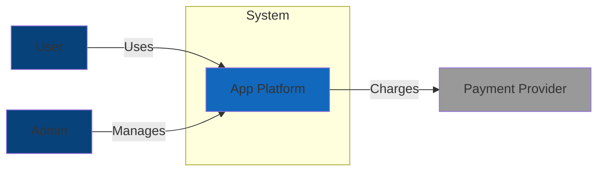
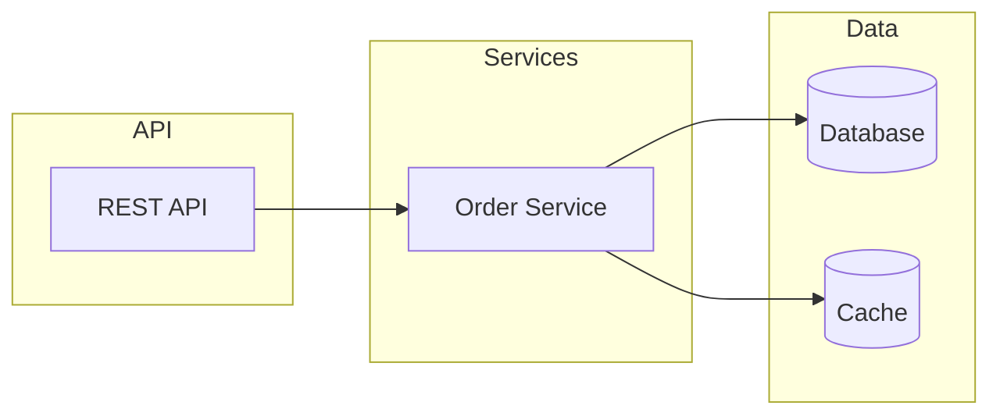
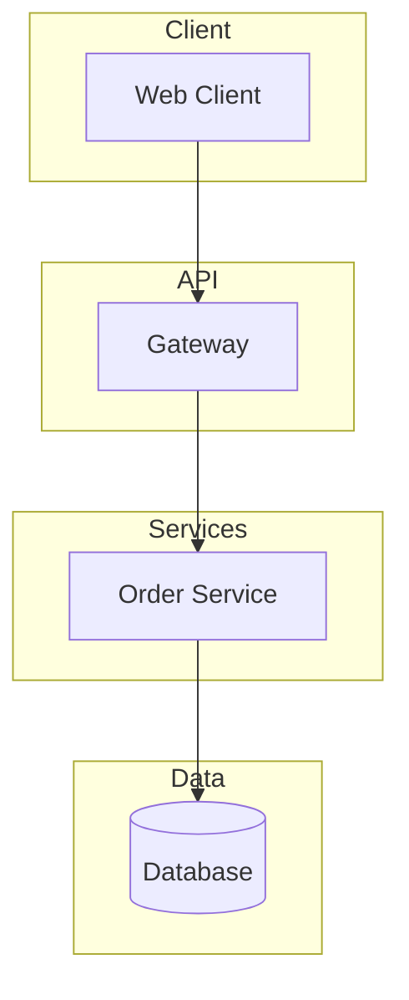
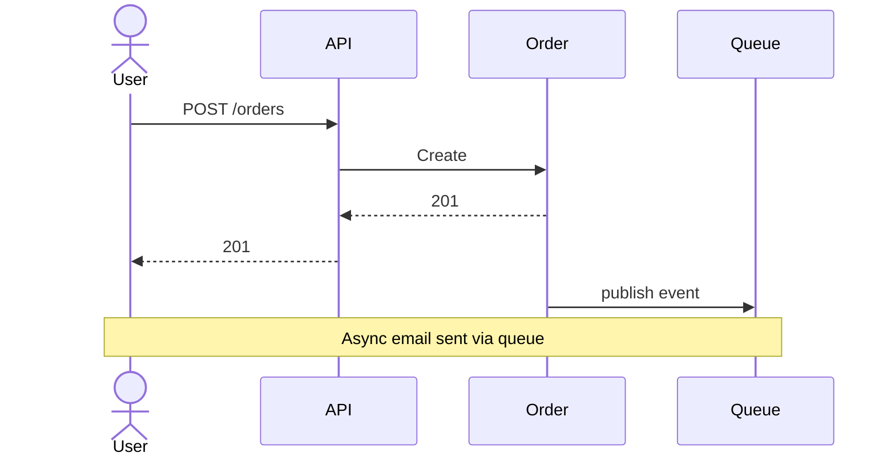
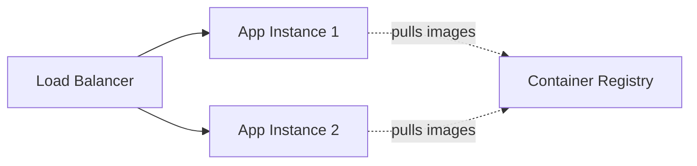
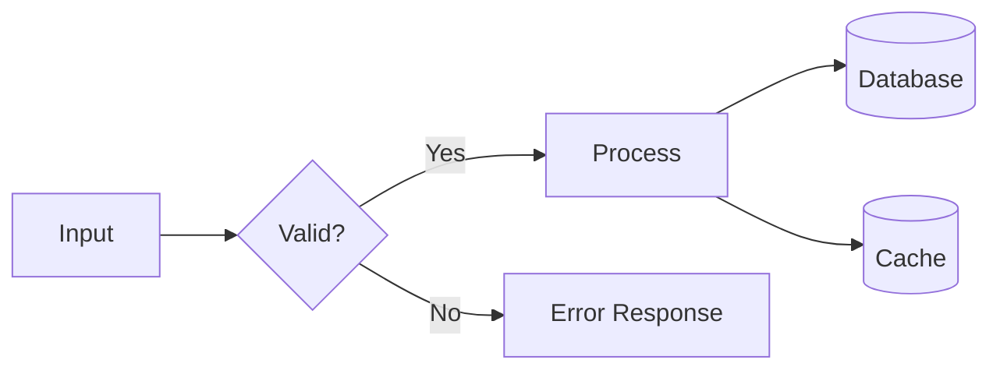
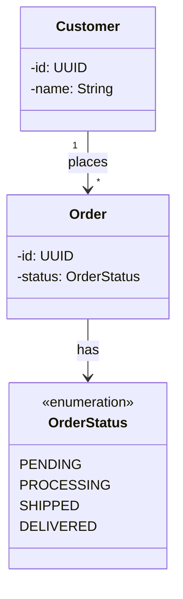
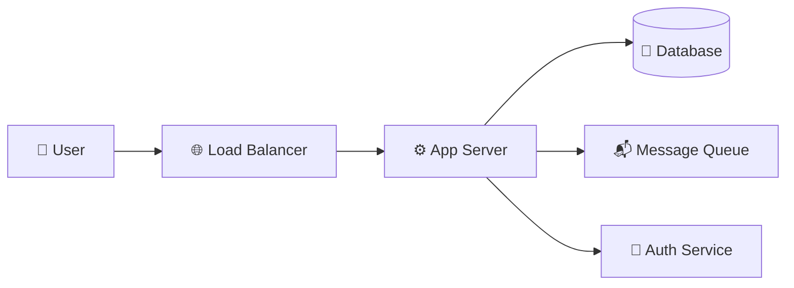

# Mermaid Diagram Examples

Compact syntax reference. The canonical `ARCHITECTURE.md` (same directory) shows a `graph TD` with subgraphs for the system architecture diagram — that is the one deliberate exception to the default below: layered views stack top-down. This file shows additional Mermaid syntax when the required views need more detail. For required views, see `../references/embedded-views.md`.

## Orientation: horizontal by default

Diagrams live in READMEs and are read by humans on screens. Default to `graph LR` (left-to-right): it matches reading order, keeps chains visible without vertical scrolling, and reads at a glance. Choose `graph TD`/`graph TB` only for the structural cases below.

| Use `graph LR` (default) when… | Use `graph TD`/`graph TB` when… |
|---|---|
| The diagram tells a sequence or story: pipelines, request flows, deployment stages, data flow, lifecycles (Proposal → Specs → Tasks → Apply → Verify → Archive) | The diagram is a layered decomposition: architecture layers (Client → API → Service → Data), C4 Container/Component stacks |
| The graph is chain-shaped: few nodes per level, most edges flow forward | The graph is a hierarchy: org charts, dependency trees, git branch topology, decision trees |
| Fan-out is bounded (one node → ≤3 children) | Fan-out is wide (one node → many children): LR would overflow the README viewport, TD keeps width bounded |

Rules of thumb:

- In a README, `graph LR` wins for anything that reads as a process; reserve `TD` for structure (layers, trees, hierarchies).
- One diagram = one concept (see Unicode section below). If a diagram exceeds ~12 nodes, split it into views instead of stretching either axis.
- `sequenceDiagram` keeps actors/messages flowing top-down in time order — that is temporal, not a graph direction; do not force it horizontal.
- `classDiagram` and `erDiagram` manage their own layout; do not force a direction on them.

## C4 Context — `style` declarations for actor/role coloring



## Component — `subgraph` nesting with `<br/>` line-break labels



## Layered architecture — the vertical exception

Use `graph TD` when the diagram IS a layer stack: Client → API → Service → Data reads top-down naturally, and each layer's nodes share a row. Mirrors the canonical `ARCHITECTURE.md` system diagram.



## Sequence — `actor`, `participant`, and `Note over` for async context



## Deployment — dotted `-.->` for non-physical edges (image pulls, config)



## Data Flow — `{Decision}` shape and labeled edges `-->|label|`



## Class / ERD — `<<enumeration>>` stereotype and cardinality `"1" --> "*"`



## Unicode Semantic Symbols — add meaning without clutter

One diagram = one concept; symbols reinforce roles, they do not replace labels.

| Category | Symbols |
|----------|---------|
| Infrastructure | ☁️ 🌐 🔌 📡 🗄️ |
| Compute | ⚙️ ⚡ 🔄 ♻️ 🚀 💨 |
| Data | 💾 📦 📊 📈 🗃️ 🧊 |
| Messaging | 📨 📬 📤 📥 🐰 📢 |
| Security | 🔐 🔑 🛡️ 🚪 👤 🎫 |
| Monitoring | 📝 📊 🚨 ⚠️ ✅ ❌ |



## High-Contrast Styling

- Every `classDef` MUST specify a `color:` property.
- Light background → dark text; dark background → light text.
- Direction is irrelevant to styling: `classDef` applies to any graph orientation.

```mermaid
graph LR
    classDef primary fill:#90EE90,stroke:#333,stroke-width:2px,color:darkgreen
    classDef secondary fill:#87CEEB,stroke:#333,stroke-width:2px,color:darkblue
    classDef database fill:#E6E6FA,stroke:#333,stroke-width:2px,color:darkblue
    classDef error fill:#FFB6C1,stroke:#DC143C,stroke-width:2px,color:black
```
